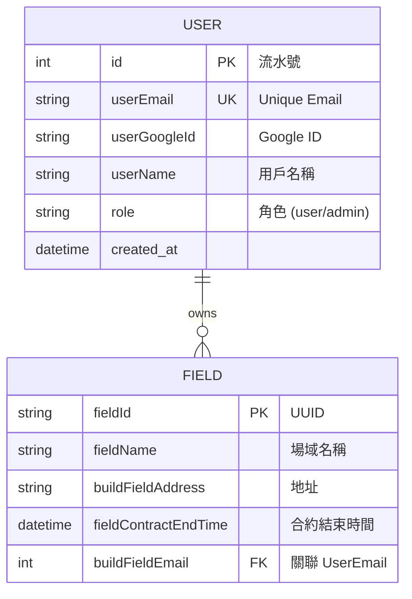

# 🚀 MagabankBackend 專案開發報告

## 1. 專案概述 (Project Overview)

**MagabankBackend** 是一個基於 **Spring Boot** 框架建構的後端系統，主要功能包括整合 **Google OAuth2** 進行第三方登入驗證、JWT (JSON Web Token) 身份授權，以及場域 (Field) 資料的管理（新增與查詢）。系統採用分層架構 (Layered Architecture)，並使用 PostgreSQL 作為資料儲存庫。

### 🛠️ 技術棧 (Tech Stack)

| 類別 | 技術 / 套件 | 說明 |
| --- | --- | --- |
| **語言** | Java 17 |  |
| **框架** | Spring Boot 3.5.7 | 核心應用程式框架 |
| **資料庫** | PostgreSQL | 關聯式資料庫 |
| **ORM** | Spring Data JPA | 資料持久層操作 |
| **安全性** | Spring Security & JWT | 身份驗證與授權 (jjwt-api 0.11.5) |
| **第三方整合** | Google API Client | 用於 Google Sign-In 驗證 |
| **工具** | Lombok | 簡化 Java 程式碼 (Getter/Setter/Builder) |
| **建置工具** | Maven 3.3.4 | 專案依賴管理 |

---

## 2. 系統架構與設計 (System Architecture)

專案採用標準的 **Controller-Service-Repository** 三層式架構，確保職責分離。

### 🏗️ 架構分層

1. **Controller Layer (`controller`)**: 處理 HTTP 請求，驗證參數，回傳標準化響應 (`CommonResponse`)。
2. **Service Layer (`service`)**: 執行核心業務邏輯 (如：驗證 Google Token、檢查合約時間)。
3. **Repository Layer (`repository`)**: 與資料庫進行互動，繼承 `JpaRepository`。
4. **Security Layer (`config`)**: 處理請求攔截、JWT 解析與權限控管。

### 🔒 安全性設計 (Security Architecture)

系統使用 **Stateless (無狀態)** 的驗證機制：

* **白名單機制**: 僅 `/api/v1/auth/google` 開放免驗證訪問。
* **JWT Filter**: 所有其他請求需經過 `JwtAuthenticationFilter`，驗證 Header 中的 `Bearer Token`。
* **權限角色**: 定義了 `user` 與 `admin` 兩種角色。

:::info
**💡 JWT 處理細節**
Token 包含使用者的 Email 與 Role，並設定了過期時間 (預設 1 小時)。
:::

---

## 3. 資料庫設計 (Database Design)

使用 PostgreSQL，主要包含兩張資料表：`_user` 與 `_field`。

### 📊 ERD 關聯圖 (Mermaid)



### 資料表細節

1. **UserEntity (`_user`)**:
* 儲存用戶基本資訊與 Google ID。
* `role` 欄位區分管理員與一般用戶。
* 與 `FieldEntity` 為 **一對多 (One-to-Many)** 關係。


2. **FieldEntity (`_field`)**:
* 主鍵使用 UUID 生成策略 (`GenerationType.UUID`)。
* 包含審計欄位 `createdDate` 與 `updatedDate` (需配合 `@EnableJpaAuditing`)。


---

## 4. 功能模組詳解 (Functional Modules)

### 🔑 1. 身份驗證模組 (Authentication)

此模組處理 Google 第三方登入並發放系統專用的 JWT。

* **API 路徑**: `POST /api/v1/auth/google`
* **處理流程**:
1. 前端發送 Google ID Token 至後端。
2. `GoogleAuthService` 使用 `GoogleIdTokenVerifier` 向 Google 驗證 Token 合法性。
3. 驗證通過後，`UserImpl` 檢查資料庫是否已有該用戶：
* **若無**: 建立新用戶。若 Email 在 `admin.email` 設定清單中，則賦予 `admin` 權限，否則為 `user`。
* **若有**: 取出既有用戶資料。


4. `JwtService` 產生包含用戶資訊的 JWT 字串並回傳。


### 🏢 2. 場域管理模組 (Field Management)

提供已登入用戶建立與查詢場域的功能。

* **新增場域 (`POST /api/v1/add/field`)**:
* **邏輯檢查**:
* 名稱或地址不可為空。
* 合約結束時間不可為空，且必須在「現在時間」之後。
* 同一用戶不可重複建立相同名稱的場域 (`getFieldEntityByBuildFieldEmailAndFieldName`)。


* **資料寫入**: 驗證通過後寫入 `_field` 資料表。


* **查詢場域 (`GET /api/v1/get/field`)**:
* 從 `SecurityContext` 取得當前登入用戶。
* 回傳該用戶名下所有場域列表 (`List<FieldData>`)，時間格式化為 `yyyy-MM-dd HH:mm:ss`。


---

## 5. 專案結構與檔案配置 (Project Structure)

專案遵循 Maven 標準目錄結構，核心程式碼位於 `src/main/java/com/example/magabankbackend`。

```plaintext
com.example.magabankbackend
├── 📂 base                  # 基礎類別
│   ├── 📄 Role.java         # 角色枚舉 (user, admin)
│   └── 📂 exception         # 全域異常處理
├── 📂 config                # 配置類別
│   ├── 📄 ApplicationConfig.java     # AuthManager, PasswordEncoder 配置
│   ├── 📄 JwtAuthenticationFilter.java # JWT 過濾器
│   ├── 📄 SecurityConfiguration.java   # Spring Security 安全鏈配置
│   └── ... (UserDetailsService, JwtService)
├── 📂 controller            # 控制層 (API Endpoints)
│   ├── 📄 UserController.java   # 處理 Google 登入
│   └── 📄 FieldController.java  # 處理場域 CRUD
├── 📂 dtos                  # 資料傳輸物件
│   ├── 📂 request           # (LoginRequest, AddFieldRequest)
│   ├── 📂 response          # (CommonResponse)
│   └── 📂 dto               # (FieldData)
├── 📂 entities              # 資料庫實體 (JPA Entities)
│   ├── 📄 UserEntity.java   #
│   └── 📄 FieldEntity.java  #
├── 📂 repository            # 資料庫存取層 (Interfaces)
│   ├── 📄 UserRepository.java
│   └── 📄 FieldRepository.java
└── 📂 service               # 業務邏輯層
    ├── 📂 impl              # 實作類別 (UserImpl, FieldImpl, GoogleAuthImpl)
    └── ... (Interfaces)

```

### ⚙️ 關鍵設定 (Configuration)

* **`application.properties`**:
* 定義了資料庫連線 (`jdbc:postgresql://...`)。
* 設定了 JPA DDL 模式為 `create-drop` (注意：每次重啟會清空資料庫)。
* 設定管理員 Email 清單：`yy870422@gmail.com,yy920612@gmail.com`。


---

## 6. 結論 (Conclusion)

MagabankBackend 整合了現代化的身份驗證機制 (Google OAuth + JWT)。其代碼結構展現了良好的關注點分離 (SoC)，利用 Spring Boot 生態系 (Security, Data JPA) 快速建構了安全的 RESTful API。

:::warning
**改進建議**
目前資料庫策略設為 `create-drop`，這適合開發測試，但在生產環境應改為 `update` 或 `validate` 以避免資料遺失。
:::
